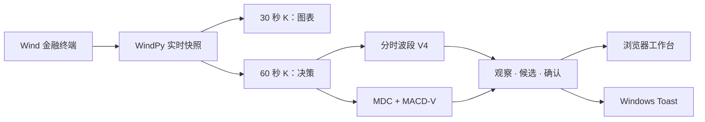

# feels-quanty

> **Local-first · Explainable · Signal only**

[](#数据与架构)
[](#运行环境)
[](#运行环境)
[](#项目结构)
[](#使用边界)

一个本地优先、可解释、不自动下单的 A 股盘中信号助手。读取 WindPy 实时量价，识别分时波段顶底与多尺度动能转折，在浏览器和 Windows 中给出买入/卖出提醒。

---

## 为什么是 feels-quanty

盘中顶底不能在极值出现的瞬间被预知。feels-quanty 将**极值时刻**与**确认时刻**明确分开：先观察结构，再等待反转和动能证据，最后才形成提醒。图上大箭头标记实际峰谷，小圆点标记系统真正能够确认的时刻。

| 产品原则 | 实现方式 |
| --- | --- |
| **Local-first** | Wind 终端、WindPy、行情缓存和提醒均留在本机 |
| **Causal** | 只使用当时已经完成的 K 线，不借用未来数据，不回改历史信号 |
| **Explainable** | 每个事件保留极值、确认价、反转进度、置信度和触发证据 |
| **Dual-engine** | 分时波段与多尺度 MACD-V 可独立启停，也可同时运行 |
| **Restart-safe** | 同日重启回放缓存恢复状态，不重新预热、不重复补发 Toast |
| **Signal-only** | 只提醒、不下单，也不依赖持仓数据推断交易动作 |

## 两套策略，一个事件语言

| 策略 | 解决的问题 | 正式提醒 |
| --- | --- | --- |
| **分时波段 V4** | 当前波段是否形成可操作的反转结构 | 候选 → 增强 → 确认 |
| **多尺度动能 MDC + MACD-V** | 转折属于什么级别，动能是否同步衰减或修复 | 中级、大级确认 |
| **开盘快速识别** | 09:30–09:35 是否出现强波段、强反转与结构破位 | 最早 09:32 |

两个主策略都有独立开关。候选事件进入前端观察，确认事件发送 Windows 提醒；候选提醒也可以单独开启。



## 信号是怎样形成的

1. **观察结构**：持续维护当前波段、候选极值和量价上下文。
2. **候选出现**：波段幅度、反转进度或动能衰减开始达到动态门槛。
3. **证据增强**：结构破位、K 线回收、量能或多尺度一致性继续累积。
4. **确认提醒**：分数与门禁通过，记录确认时刻并发送提醒。
5. **失效或去重**：候选超时、结构破坏或同一顶底已提醒时，不重复打扰。

> 30 秒 K 只负责图表表现；策略判断基于已完成的 60 秒 K。系统不会把图上的最高点或最低点冒充成当时已经可知的信号。

## 快速开始

### 运行环境

- Windows 10 / 11
- 已登录并保持运行的 Wind 金融终端
- WindPy Python：`C:\Python27\python.exe`
- Node.js `>= 22.13.0`

### 一键启动

```text
双击 start_quant_assistant.bat
```

脚本会启动 WindPy 后端和前端，并自动打开 `http://localhost:3001`。在启动窗口按 `Ctrl+C` 可停止服务。

### 首次从仓库运行

```powershell
git clone https://github.com/jp4jaypan-ai/feels-quanty.git
Set-Location feels-quanty
npm install
.\start_quant_assistant.bat
```

## 数据与架构

```text
Browser :3001
    ↕ JSON API
Python :8765
    ├─ WindPy collector       实时快照、WSI 回填、去重
    ├─ Swing V4 engine       分时波段候选/确认
    ├─ MDC + MACD-V engine   多尺度动能与自动定级
    ├─ Intraday cache        同日状态恢复
    └─ Windows notifier      本地 Toast
```

- WindPy 约每秒读取一次实时快照并去重。
- 30 秒图表 K 与 60 秒决策 K 分开维护。
- 每个完整决策分钟都会原子写入当日缓存。
- 同日重启优先回放缓存，仅对缺失区间调用 WSI 补齐。
- 跨交易日只保留关注列表和配置，不混入昨日行情与信号。

## 项目结构

```text
feels-quanty/
├─ app/                         React 盘中信号工作台
├─ backend/
│  ├─ server.py                 WindPy、API、缓存与通知
│  ├─ swing_v3.py               分时波段 V4
│  ├─ macd_divergence.py        MDC + MACD-V
│  └─ test_*.py                 策略与集成测试
├─ tests/                       前端契约测试
├─ docs/assets/                 GitHub 视觉资源
├─ start_quant_assistant.bat    Windows 一键入口
└─ start_quant_assistant.ps1    服务编排与健康检查
```

## 策略文档

| 文档 | 内容 |
| --- | --- |
| [STRATEGY_V4_CANDIDATE_CONFIRM_SPEC.md](./STRATEGY_V4_CANDIDATE_CONFIRM_SPEC.md) | 候选与确认事件模型 |
| [STRATEGY_V3_SWING_SPEC.md](./STRATEGY_V3_SWING_SPEC.md) | 分时波段引擎基础口径 |
| [STRATEGY_V3_1_DUAL_CHANNEL_SPEC.md](./STRATEGY_V3_1_DUAL_CHANNEL_SPEC.md) | 开盘快速识别与常规通道 |
| [MACD_DIVERGENCE_SPEC.md](./MACD_DIVERGENCE_SPEC.md) | MDC 自动定级与 MACD-V |
| [AI_NATIVE_FRONTEND_SPEC.md](./AI_NATIVE_FRONTEND_SPEC.md) | 前端信息架构与交互原则 |

## 开发与验证

```powershell
npm run lint
npm test

C:\Python27\python.exe backend\test_macd_divergence.py
C:\Python27\python.exe backend\test_swing_v3.py
C:\Python27\python.exe backend\test_signal_engine.py
```

## 使用边界

> [!CAUTION]
> feels-quanty 是辅助提醒工具，不是交易指令，不保证捕捉绝对最高点或最低点，也不承诺收益。正式使用前，请通过历史回放、模拟交易和人工复核评估参数，并计入手续费、滑点与实际成交约束。

---

*Built for focused intraday decisions · Local-first · No auto trading*
