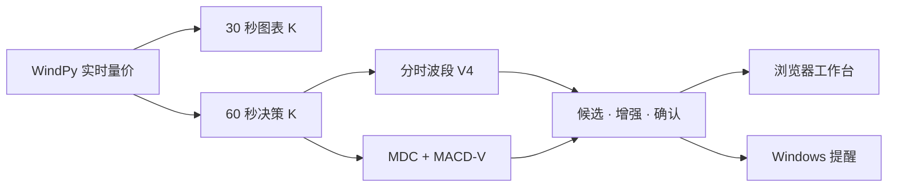

<p align='center'>
  
</p>

<h1 align='center'>feels-quanty</h1>

<p align='center'><strong>把盘中转折，变成可解释、可复盘的提醒。</strong></p>

<p align='center'>
  WindPy 实时行情 · 分时顶底 · 多尺度 MACD 背离 · Windows 本地提醒
</p>

<p align='center'>
  
  
  
  
</p>

---

## 在噪声里，只提醒值得看的转折

feels-quanty 是一个运行在本机的 A 股盘中信号工作台。它读取 WindPy 实时量价，将连续行情整理为可解释的波段结构，在浏览器与 Windows 桌面给出买入或卖出提醒。

它不自动下单，也不把事后看到的最高点、最低点伪装成实时能力。系统明确区分**极值发生**与**信号确认**：先发现候选，再等待反转与动能证据，最后形成正式提醒。

|  | 能力 | 你看到的结果 |
| --- | --- | --- |
| **01** | 实时行情 | WindPy 快照、30 秒图表 K、60 秒决策 K |
| **02** | 双策略引擎 | 分时波段与 MACD 背离可独立启停，也可同时运行 |
| **03** | 分级提醒 | 微级、小级、中级、大级；候选、增强、确认全程可追踪 |
| **04** | 本地可靠性 | 当日缓存恢复、信号去重、Windows Toast、无自动交易 |

## 从行情到提醒



> 图上大箭头对应实际峰谷，小圆点对应系统在当时真正具备足够证据的确认时刻。策略只使用已经完成的 K 线，不借用未来数据，不回改历史信号。

## 两套引擎，一套事件语言

| 引擎 | 关注点 | 输出 |
| --- | --- | --- |
| **分时波段 V4** | 波段幅度、反转进度、结构破位、K 线与量能证据 | 分时顶 / 分时底；候选 → 增强 → 确认 |
| **MDC + MACD-V** | 价格与动能背离、斜率转折、多尺度一致性 | 微级早期提醒；小级、中级、大级确认 |
| **开盘快速通道** | 09:30–09:35 的强波段、强反转与结构破位 | 最早 09:32 开始观察强信号 |

两个主引擎均有独立开关。你可以只运行其中一个，也可以让两者共同提供证据；候选提醒与正式提醒同样可以分别控制。

## 快速开始

### 运行前准备

- Windows 10 / 11
- 已登录并保持运行的 Wind 金融终端
- WindPy Python：`C:\Python27\python.exe`
- Node.js `>= 22.13.0`

### 从源码启动

```powershell
git clone https://github.com/jp4jaypan-ai/feels-quanty.git
Set-Location feels-quanty
npm install
.\start_quant_assistant.bat
```

启动器会拉起 WindPy 后端与前端，并自动打开 [http://localhost:3001](http://localhost:3001)。在启动窗口按 `Ctrl+C` 可完整停止服务。

拿到 Windows 发行包的同事无需安装源码依赖：解压全部文件后，双击 `feels-quanty.exe` 即可。

## 本地架构

```text
Browser :3001
    ↕ JSON API
Python :8765
    ├─ WindPy collector       实时快照、WSI 回填、去重
    ├─ Swing V4 engine       分时波段候选与确认
    ├─ MDC + MACD-V engine   多尺度动能、背离与自动定级
    ├─ Intraday cache        同日状态恢复
    └─ Windows notifier      本地 Toast
```

WindPy 约每秒读取一次实时快照。每根完整决策分钟都会原子写入当日缓存；同日重启优先回放缓存，只补齐缺失区间，不重新经历整段预热，也不会重复补发已经出现过的提醒。

## 项目导航

| 路径 | 内容 |
| --- | --- |
| [`app/`](./app) | React 盘中信号工作台 |
| [`backend/`](./backend) | WindPy、API、缓存、通知与两套策略引擎 |
| [`STRATEGY_V4_CANDIDATE_CONFIRM_SPEC.md`](./STRATEGY_V4_CANDIDATE_CONFIRM_SPEC.md) | 分时波段候选与确认模型 |
| [`STRATEGY_V3_1_DUAL_CHANNEL_SPEC.md`](./STRATEGY_V3_1_DUAL_CHANNEL_SPEC.md) | 开盘快速通道与常规通道 |
| [`MACD_DIVERGENCE_SPEC.md`](./MACD_DIVERGENCE_SPEC.md) | MDC 自动定级与 MACD-V 背离策略 |
| [`AI_NATIVE_FRONTEND_SPEC.md`](./AI_NATIVE_FRONTEND_SPEC.md) | 前端信息架构与交互原则 |

## 验证

```powershell
npm run lint
npm test

C:\Python27\python.exe backend\test_macd_divergence.py
C:\Python27\python.exe backend\test_swing_v3.py
C:\Python27\python.exe backend\test_signal_engine.py
```

## 使用边界

> [!CAUTION]
> feels-quanty 是辅助提醒工具，不是交易指令，不保证捕捉绝对最高点或最低点，也不承诺收益。正式使用前，请通过历史回放、模拟交易与人工复核评估策略，并计入手续费、滑点和实际成交约束。

<p align='center'><sub>LOCAL-FIRST · EXPLAINABLE · SIGNAL ONLY</sub></p>
