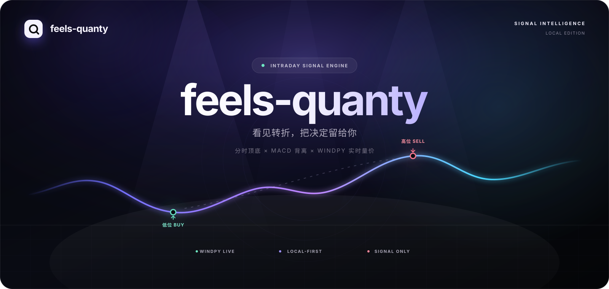

# feels-quanty

> **Local-first · Explainable · Signal only**

[
            else:
                self.send_json(404, {'ok': False, 'error': 'not found'})
        except Exception as exc:
            self.send_json(400, {'ok': False, 'error': str(exc)})

MONITOR = WindMonitor(STATE)

def main():
    global STATE, MONITOR
    cache = IntradayCache(CACHE_PATH)
    cached_payload = cache.load()
    STATE = SharedState()
    MONITOR = WindMonitor(STATE, cache)
    MONITOR.restore_cache(cached_payload)
    server = ThreadedHTTPServer((HOST, PORT), ApiHandler)
    print('feels-quanty backend listening on http://%s:%s' % (HOST, PORT))
    # Python 2.7 stdout can be ASCII when redirected by the launcher. Do not
    # interpolate the Chinese absolute project path into startup logs.
    print('Intraday cache status: %s' % STATE.cache_status)
    try:
        server.serve_forever()
    except KeyboardInterrupt:
        pass
    finally:
        MONITOR.stop(); server.server_close()

if __name__ == '__main__':
    main()
